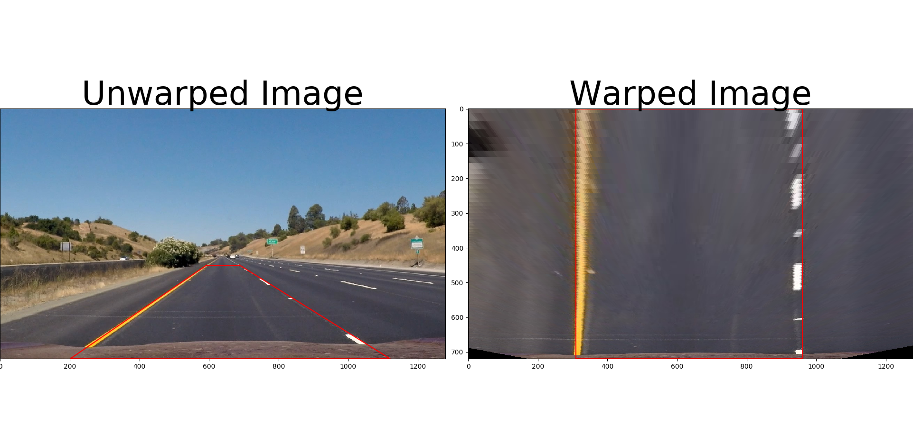

## Writeup

**Advanced Lane Finding Project Writeup**

The goals / steps of this project are the following:

* Compute the camera calibration matrix and distortion coefficients given a set of chessboard images.
* Apply a distortion correction to raw images.
* Use color transforms, gradients, etc., to create a thresholded binary image.
* Apply a perspective transform to rectify binary image ("birds-eye view").
* Detect lane pixels and fit to find the lane boundary.
* Determine the curvature of the lane and vehicle position with respect to center.
* Warp the detected lane boundaries back onto the original image.
* Output visual display of the lane boundaries and numerical estimation of lane curvature and vehicle position.

[//]: # (Image References)

[image1]: ./examples/undistort_output.png "Undistorted"
[image2]: ./test_images/test1.jpg "Road Transformed"
[image3]: ./examples/binary_combo_example.jpg "Binary Example"
[image4]: ./examples/warped_straight_lines.jpg "Warp Example"
[image5]: ./examples/color_fit_lines.jpg "Fit Visual"
[image6]: ./examples/example_output.jpg "Output"
[video1]: ./project_video.mp4 "Video"

## [Rubric](https://review.udacity.com/#!/rubrics/571/view) Points

### Here I will consider the rubric points individually and describe how I addressed each point in my implementation.  

---

### Writeup / README

#### 1. Provide a Writeup / README that includes all the rubric points and how I addressed each one.  

You're reading it!

### Camera Calibration

#### 1. Briefly state how I computed the camera matrix and distortion coefficients. Provide an example of a distortion corrected calibration image.

The code for this step is contained in the lines of 11-36 located in "./Advanced_Line.py "

I start by preparing "object points", which will be the (x, y, z) coordinates of the chessboard corners in the world. Here I am assuming the chessboard is fixed on the (x, y) plane at z=0, such that the object points are the same for each calibration image.  Thus, `objp` is just a replicated array of coordinates, and `objpoints` will be appended with a copy of it every time I successfully detect all chessboard corners in a test image.  `imgpoints` will be appended with the (x, y) pixel position of each of the corners in the image plane with each successful chessboard detection.  

I then used the output `objpoints` and `imgpoints` to compute the camera calibration and distortion coefficients using the `cv2.calibrateCamera()` function.  I applied this distortion correction to the test image using the `cv2.undistort()` function and obtained this result:
 


### Pipeline (single images)

#### 1. Provide an example of a distortion-corrected image.

To demonstrate this step, I will describe how I apply the distortion correction to one of the test images like this one:


#### 2. Describe how (line 48-75 in "./Advanced_Line.py " ) I used color transforms, gradients or other methods to create a thresholded binary image.  Provide an example of a binary image result.

I used a combination of color (S and V channel) and gradient(sobel x) thresholds to generate a binary image (thresholding steps at lines 48-75 in `Advanced_Line.py`).  Here's an example of my output for this step.


#### 3. Describe how (line 78-86 in "./Advanced_Line.py ") I performed a perspective transform and provide an example of a transformed image.

The code for my perspective transform includes a function called `warper()`, which appears in lines 78 through 86 in the file `Advanced_Line.py`  .  The `warper()` function takes as inputs an image (`img`), as well as source (`src`) and destination (`dst`) points.  I chose the hardcode the source and destination points (in line 136 -147 in `Advanced_Line.py` ) the following manner:

```python
src = np.float32(
    [(image.shape[1]-592,image.shape[0]-270),
    (image.shape[1]-160,image.shape[0]-1),
    (202,image.shape[0]-1),
    (593,image.shape[0]-270)])
dst = np.float32(
    [(960,0),
    (960,image.shape[0]-1),
    (310,image.shape[0]-1),
    (310,0)])
```

This resulted in the following source and destination points:

| Source        | Destination   | 
|:-------------:|:-------------:| 
| 688, 450      | 960, 0        | 
| 1120, 719     | 960, 719      |
| 202, 719      | 310, 719      |
| 593, 450      | 310, 0        |

I verified that my perspective transform was working as expected by drawing the `src` and `dst` points onto a test image and its warped counterpart to verify that the lines appear parallel in the warped image.



#### 4. Describe how (in line 14-127 of 'Line.py' function of slide_fit) I identified lane-line pixels and fit their positions with a polynomial?

when I got a warped binary image, I first take a histogram along all the columns in the lower half of the image to find the peaks of the lines which is the start of the line, then I want to find which "hot" pixels are associated with the lane lines, I use the slide windows to search the area which pixels is more than minpix = 50, and I will do mean on this area to position the lines.

I also set  deques to save the results fitted in last several frames, then do average to smooth the current result.
Then I did some other stuff and fit my lane lines with a 2nd order polynomial kinda like this :


#### 5. Describe how (in line 105-125 of 'Line.py' function of slide_fit) I calculated the radius of curvature of the lane and the position of the vehicle with respect to center.

I did this in line 105-125 of `Line.py` function of slide_fit

#### 6. Provide an example image of your result plotted back down onto the road such that the lane area is identified clearly.

I implemented this step in lines 88-128 in my code in `Advanced_Line.py` in the function `drawing()`.  Here is an example of my result on a test image:


---

### Pipeline (video)

#### 1. Provide a link to your final video output.  Your pipeline should perform reasonably well on the entire project video (wobbly lines are ok but no catastrophic failures that would cause the car to drive off the road!).

in output_video/output1.mp4

Here's a [link to my video result](./output_video/output1.mp4)

---

### Discussion

#### 1. Briefly discuss any problems / issues you faced in your implementation of this project.  Where will your pipeline likely fail?  What could you do to make it more robust?

In the beginning I could not detect the lines on the bridge(sunshine) and in the shadow, because the color threhold I chosen could not find the lines in sunshine and shadow, so in color threhold module I combined the S (HLS) and V (HSV) channels to detect both yellow and white lines.
The pipeline might fail when come across the lines are miss in the road for a period, during the period some other objects are detected by the pipline, the pipline will treat the detection as a right search, then the 'lines' detected will get deviation. I will improve it if I were going to pursue this project further, I will check whether the two lane lines are paralleled, if not I will discard the current lines, use the previous results.  
